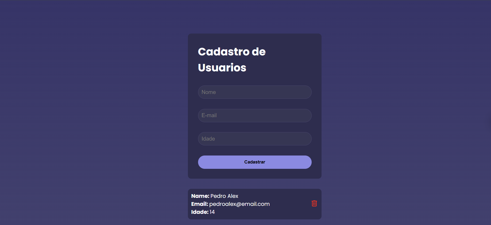

# Nome do Projeto
Sitema de Cadastros de Usuários

## 📸 Preview

## 🚀 Tecnologias

1 - Vite + React
2 - Axios (Conxão com a API)

## ✨ Funcionalidades
1 - Criação de usuário
2 - Lista usuário do banco de dados
3 - Deleção de usuários

## ⚙️ Como Executar

1- O site foi hospedado no link: https://cadastro-de-usuarios-react-node.vercel.app/

## 🎯 Aprendizados

Neste projeto aprendi os conhecimentos, e coloquei em prática o consumo de APIS, estruturação de Rotas no padrão RESTful.
Bem como útlizar o react para construção do front-end

## 👨‍💻 Autor

Nome: Alex Sandro Santos
Email: alexsandrotj94@gmail.com
LinkedIn: https://linkedin.com/in/alex-sandro-do-santos